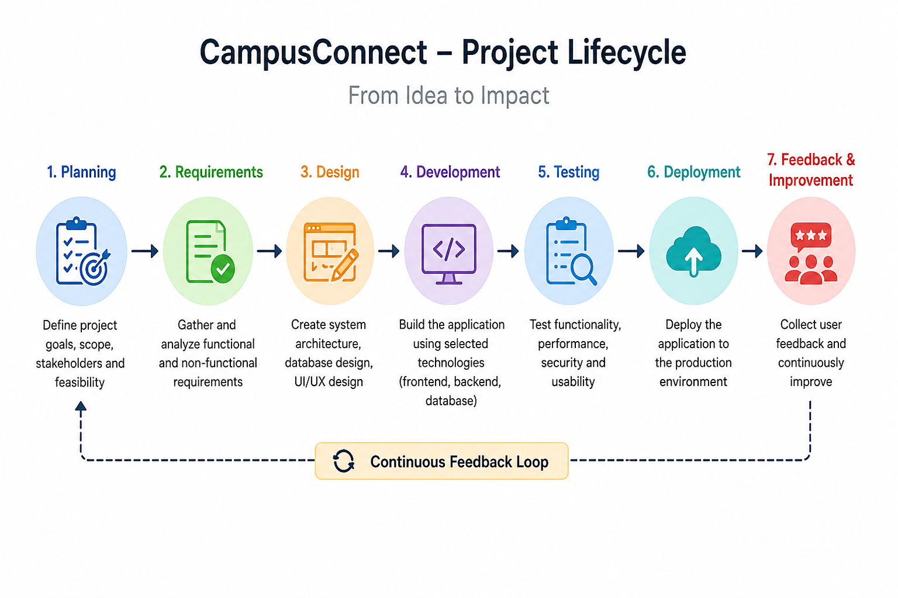

# CampusConnect

CampusConnect is a planned web-based platform for managing some common student and campus-related activities from one place.

This project is being developed as part of my internship work. The **Week 1 task is mainly focused on project planning and requirements analysis**, so the actual application development has not started yet.

## Why I chose this project

In colleges, students often receive information from different places such as WhatsApp groups, emails, notice boards, forms and college websites. Similarly, submitting a complaint or service request can sometimes involve a separate process.

The idea behind CampusConnect is to make these common activities easier by bringing them together in one platform.

## What CampusConnect will do

The planned platform will have different features depending on the user.

### For Students

* Login to the platform
* View important announcements
* See upcoming college events
* Register for events
* Submit campus service requests
* Check the status of submitted requests
* Receive important notifications
* Give feedback after a request is completed

### For Staff

* View service requests
* Check pending requests
* Update request status
* Manage requests assigned to them

### For Admin

* Manage users and roles
* Manage announcements and events
* View basic statistics
* Manage other basic platform settings

## Project Scope

For the first version, I am keeping the project limited to the main features mentioned above.

Things like online fee payment, a complete LMS, mobile applications, live chat and AI-based counselling are **not part of the first version**. They can be considered later if the basic system works properly.

## Project Flow

The planned development process is:

**Planning → Requirements → Design → Development → Testing → Deployment → Feedback**



The idea is not to consider the project finished immediately after deployment. Feedback from students and staff can be used to improve later versions.

## Requirements

During Week 1, I identified both functional and non-functional requirements.

Some important functional requirements are:

* User login and role management
* Student dashboard
* Announcements
* Events and event registration
* Service request submission
* Request tracking
* Staff request management
* Notifications
* Admin management

The project will also consider non-functional requirements such as:

* Security
* Performance
* Usability
* Accessibility
* Availability
* Data backup
* Maintainability

The complete requirements are documented in the Week 1 project planning document.

## Technology I am planning to use

| Part              | Planned Technology            |
| ----------------- | ----------------------------- |
| Frontend          | React + TypeScript            |
| Backend           | Java + Spring Boot            |
| Database          | PostgreSQL                    |
| Version Control   | Git & GitHub                  |
| API Documentation | Swagger / OpenAPI             |
| Testing           | JUnit and browser/API testing |

These are the technologies currently planned for the project. They may change later depending on the project requirements.

## Planned Timeline

The initial plan is for around **12 weeks**.

* **Week 1:** Planning and requirements
* **Week 2:** UI design and system design
* **Weeks 3–4:** Project setup, login and basic structure
* **Weeks 5–6:** Announcements and events
* **Weeks 7–8:** Service request system
* **Weeks 9–10:** Admin features and notifications
* **Week 11:** Testing and pilot testing
* **Week 12:** Deployment and documentation

This is an initial plan, so some changes are expected once actual development starts.

## Week 1 Work

For this week, I worked on:

* Understanding the problem
* Defining the project idea
* Identifying users and stakeholders
* Deciding the project scope
* Writing functional requirements
* Writing non-functional requirements
* Preparing user stories
* Identifying project risks
* Creating a project timeline
* Estimating resources and effort
* Planning the technology stack
* Preparing a basic testing plan

## Repository Structure

```text
CampusConnect/
│
├── README.md
│
├── docs/
│   ├── Week_1_Project_Planning.docx
│   └── campusconnect_lifecycle.png
│
├── requirements/
│   └── requirements.md
│
├── planning/
│   └── project-timeline.md
│
└── .gitignore
```

More folders will be added when actual development starts.

## Current Status

**Currently completed:** Week 1 – Project Planning and Requirements Analysis

The next step is to review the requirements and start working on the basic UI and system design.

## Project Note

CampusConnect is currently a **hypothetical project created for my internship task**. The project plan, requirements, timeline and technology choices are proposed as part of the planning exercise.

---

**Created by Sunny**
Engineering Student | Internship Project


## Week 2 – Design Documentation and Architecture

For Week 2, I prepared the technical design and architecture plan for CampusConnect.

This includes:

- High-level system architecture
- Frontend and backend structure
- Database design
- Module interactions
- Data flow
- REST API design
- Technology stack and decisions
- Security design
- Performance assumptions
- Testing approach
- Technical risks
- Future scaling plan

### Week 2 Deliverables

- Design documentation
- System architecture diagram
- Data flow diagram
- Service request flow diagram